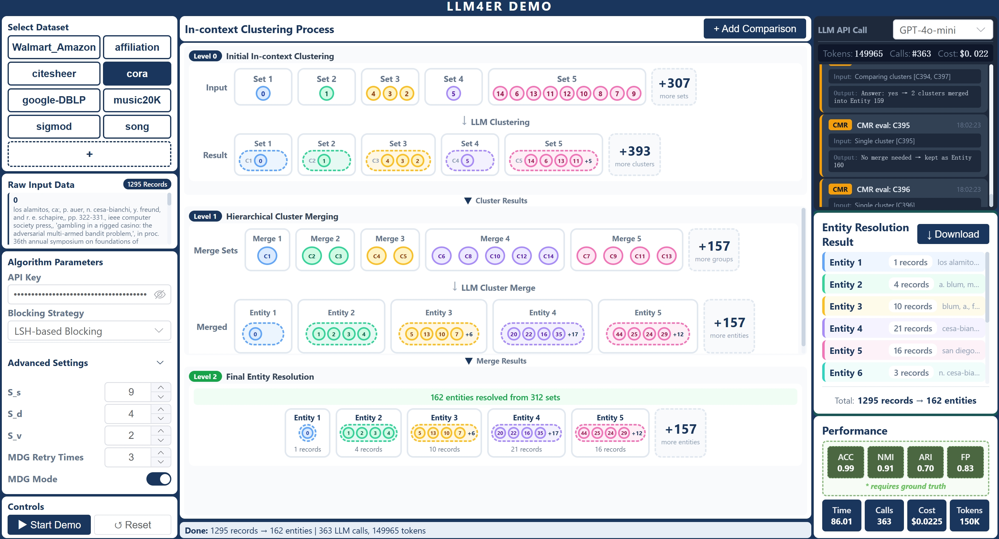

# LLM-CER: An Interactive System for In-context Clustering-based Entity Resolution with Large Language Models

This repository contains the source code of the front-end and back-end used in our demo paper: **LLM-CER: An Interactive System for In-context Clustering-based Entity Resolution with Large Language Models**, by Haoyu Wang, Haitong Tang, Jiajie Fu, Arijit Khan, Sharad Mehrotra, Xiangyu Ke, Yunjun Gao.

---

Entity Resolution (ER) identifies and links records that refer to the same real-world entity. Rule-based approaches rely on explicit similarity functions, while deep learning and pre-trained language model (PLM)-based methods require large amounts of task-specific labeled data, both of which are often difficult to obtain. Large Language Models (LLMs) provide a promising alternative via zero-shot or few-shot prompting. However, existing LLM-based ER methods still adopt the pairwise matching paradigm, leading to poor scalability and high API costs on large datasets. We introduce LLM-CER (**LLM**-powered **C**lustering-based **ER**), an interactive, end-to-end system that instructs LLMs to perform in-context clustering of records, that is, *converting ER from pairwise matching into a clustering problem*, to reduce the number of costly LLM interactions while preserving high matching quality. LLM-CER contributes three elements. First, a novel *in-context clustering paradigm* and a systematic design-space study of factors that affect LLMs' clustering behavior (set size, within-set diversity, record variation, and ordering). Second, an *extensible pipeline and UI* that let users configure blocking, select dataset subsets, tune clustering hyperparameters, and switch LLM models before execution. Third, an *interactive visualization and monitoring suite* that show hierarchical clustering steps, flag potential misclusters, log every LLM API call, and report clustering quality and efficiency metrics across models and parameter settings. In the demo, attendees will (1) run end-to-end ER on representative datasets, (2) compare metric and cost trade-offs across configurations and LLMs, and (3) inspect and correct ambiguous clusters via the visualization tools. Our demonstration video is at [https://youtu.be/vDhntqB2PSQ].



---

## Paper

Our full research paper is published at **SIGMOD 2025**:

[](https://doi.org/10.1145/3749170)

---

## Usage

### (1) Back-end

```bash
conda create -n LLM4ER python=3.10 -y
conda activate LLM4ER
cd LLM4ER/backend
pip install -r requirements.txt
uvicorn main:app --reload --port 8000
```

### (2) Front-end

```bash
cd LLM4ER/frontend
npm install
npm run dev
```

### (3) Open the web page

After you deploy the project, open [http://localhost:5173](http://localhost:5173).


